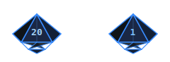

  

  
  
  

Software engineer at [**@wassamara-dev**](https://github.com/wassamara-dev), building secure financial integrations and enterprise systems.

- Reliable API integrations, cloud-native architecture, and production observability
- Modern development workflows, automation, and solid software design
- Open to fintech, scalable platforms, and cloud-native collaboration

<table align="center">
  <tr>
    <td align="center" width="200" title="Backend development"><b>Backend</b> C# · .NET · REST · Integrations</td>
    <td align="center" width="200" title="Cloud infrastructure"><b>Cloud</b> AWS · Docker · Automation</td>
    <td align="center" width="200" title="Monitoring and tracing"><b>Observability</b> OpenTelemetry · Grafana · Elastic</td>
  </tr>
  <tr>
    <td align="center" width="200" title="User interfaces"><b>Frontend</b> Vue · JavaScript · HTML/CSS</td>
    <td align="center" width="200" title="CI/CD and delivery"><b>DevOps</b> GitHub Actions · GitLab · Jenkins</td>
    <td align="center" width="200" title="Day-to-day tooling"><b>Tools</b> Postman · Swagger · PowerShell</td>
  </tr>
</table>

  
  
  
  
  
  
  
  
  
  

  
  
  
  
  
  
  
  
  
  

Hover icons for tooltips · click to open docs

  

More projects coming soon.

  

  
  

  

  

Outside of code: tabletop RPG enthusiast

